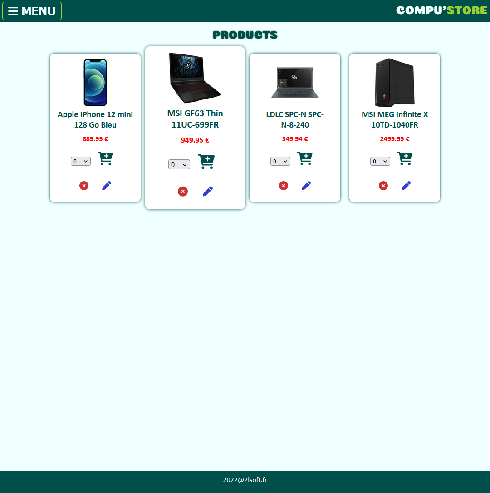
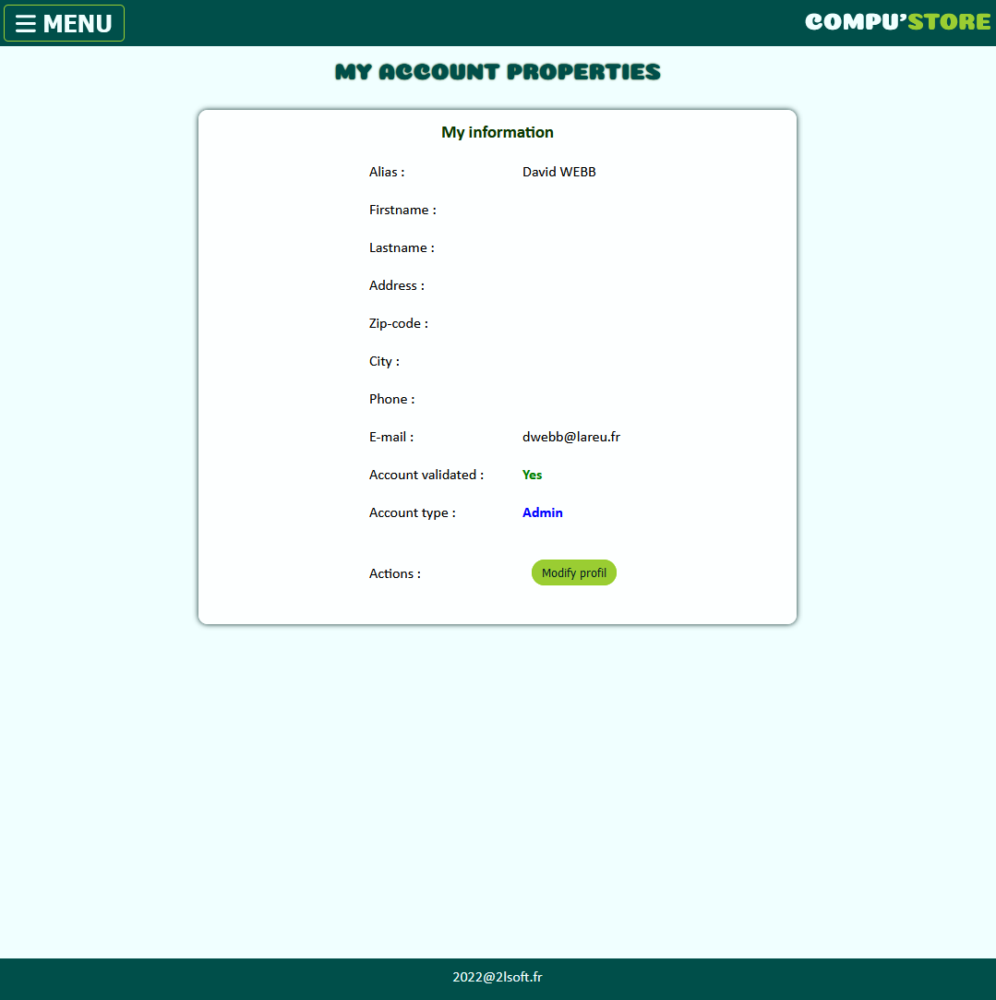
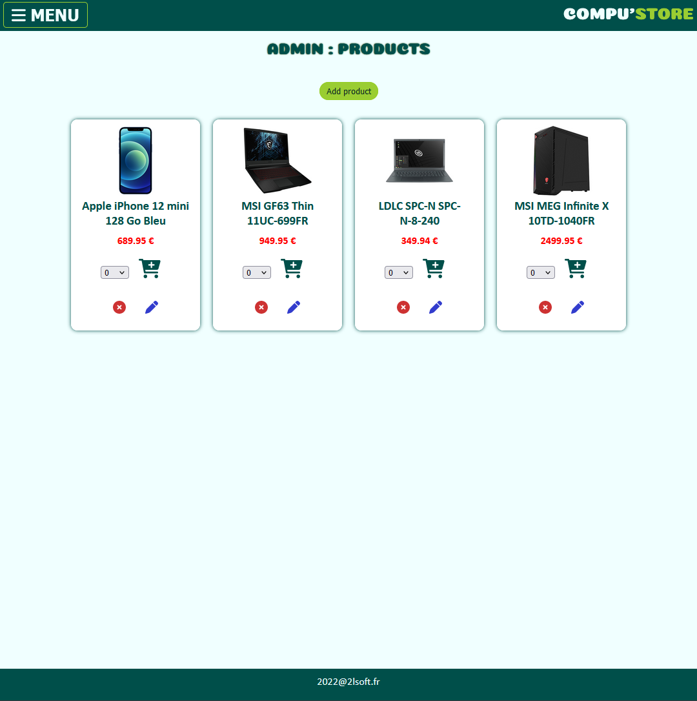
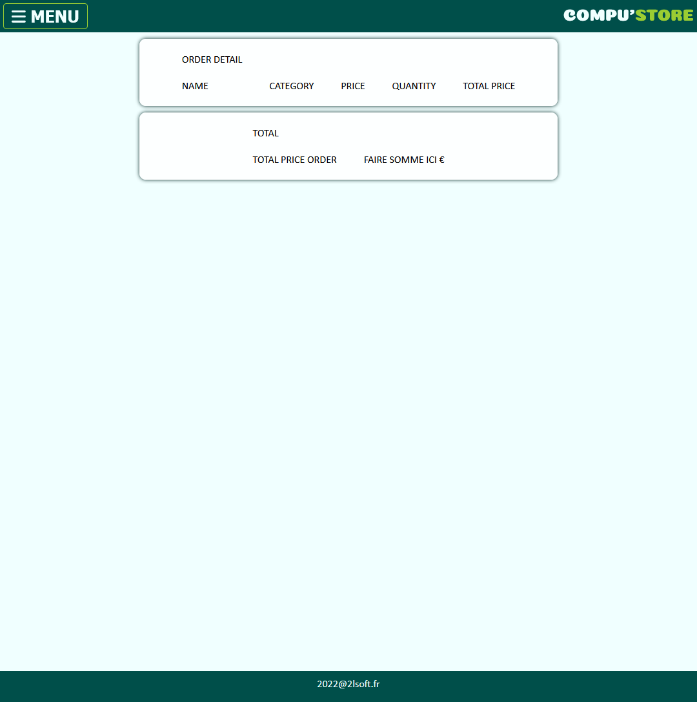
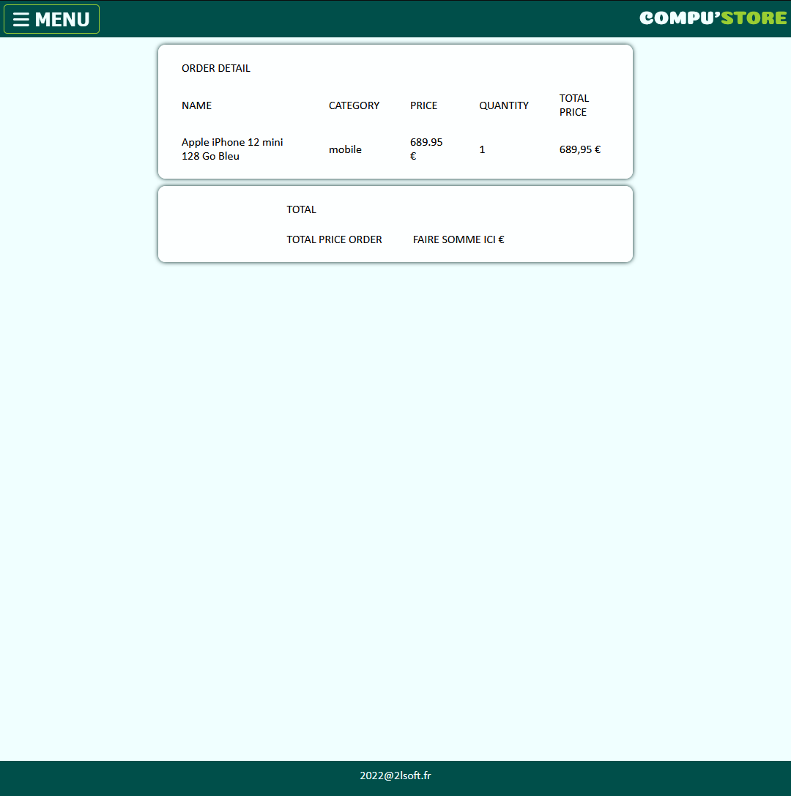

## Compu'Store Front
 
 
 
 
 
 

Contexte : 
- home : page d'accueil avec texte
- store : visiteur peuvent voir le store mais si clique sur les boutons, un message d'auth s'affiche
- profile : l'utilisateur peut changer le contenu en cliquant sur modifier et doit etre identifier pour le faire
- admin panel :
  - permet la modification, l'ajout et la supression d'un article ou categorie ou utilisateur
    - l'idée est de faire un panel menant au 3 sections ( dans le cas présent seul le product est mis en ajout de produit)
    - doit etre ajouter aussi une visuealisation des orders
- cart : affichage du panier (LS) avec factureation total
- contact : mailto vers email pour contact
- signin/up/out : identification de l'utilisateur. 

et une fois terminer : REfacto des codes + CSS.

### TO DO

back:(90% terminé)
- mail de validation de compte + mdp oublié
- faire la route purchase and purchase detail (pas faite pour voir un peu comment articuler le cart)
- Verifier les que les routes sont bien sous controle.

---

front (50% terminé):
- ajouter module de téléchagement de l'image a l'ajout d'un produit + édition d'un produit et la suppression
- ajouter la gestion des : 
    - role
    - category
    - panneau de contrôle des orders (admin)
    - panneau de visualisation des order user

- barre de recherche des produits dans le stores pour le user

- amélioration du cart + paiement en ligne (api)
- refacto le cart / LS => redux

et en toute fin :
- Refacto le code

(bilan autocritique : MP)